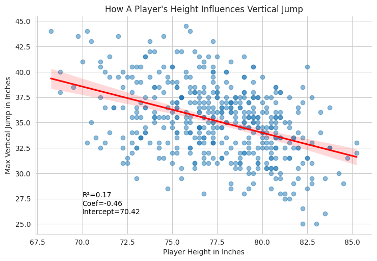
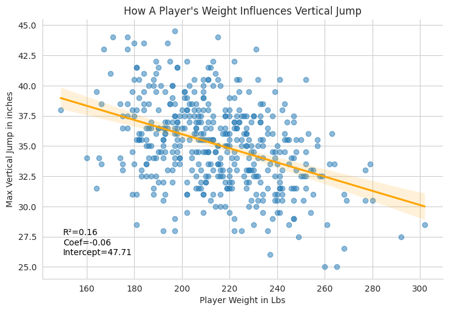
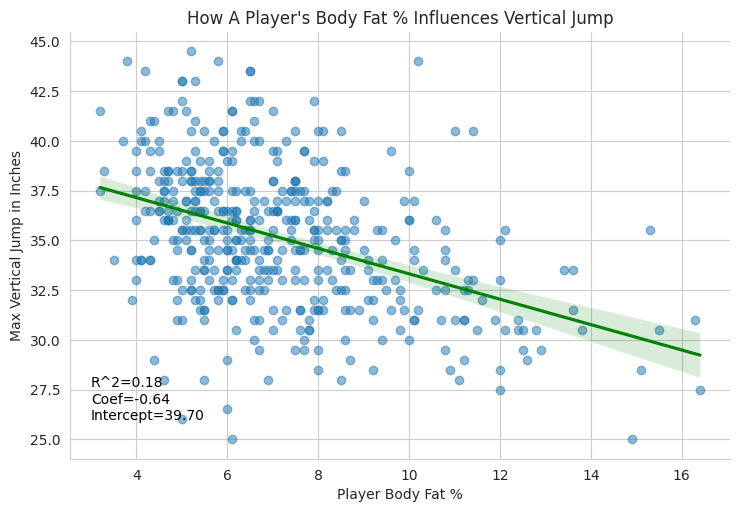
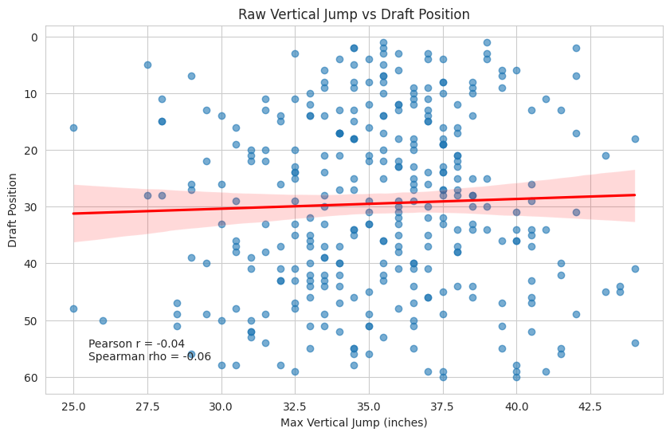
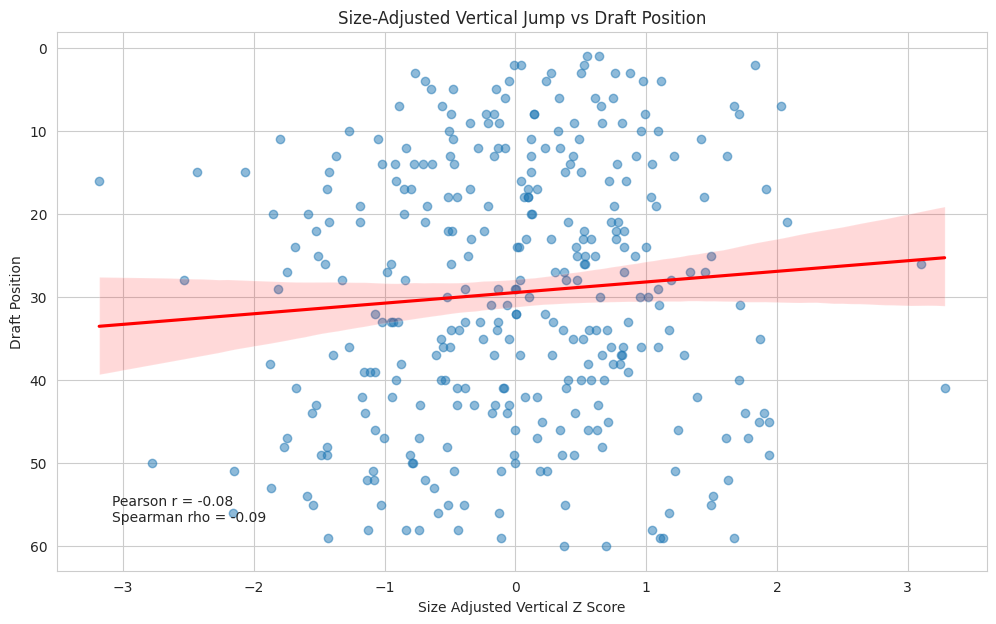
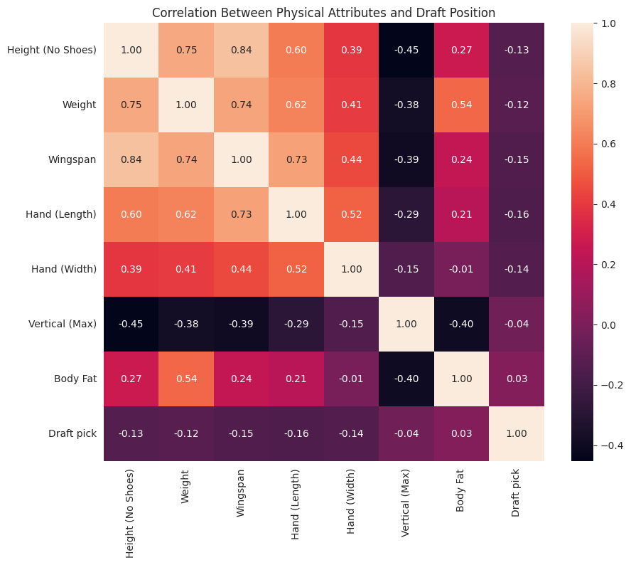
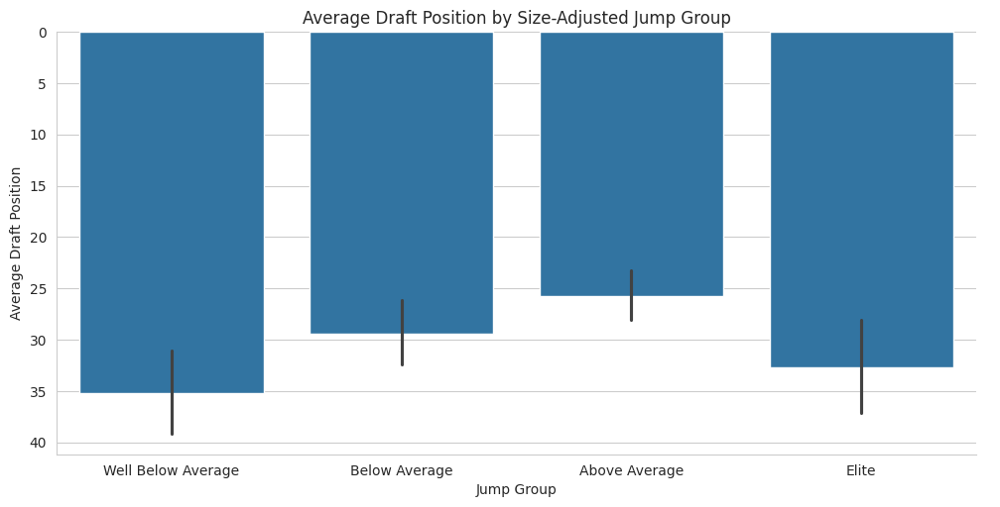
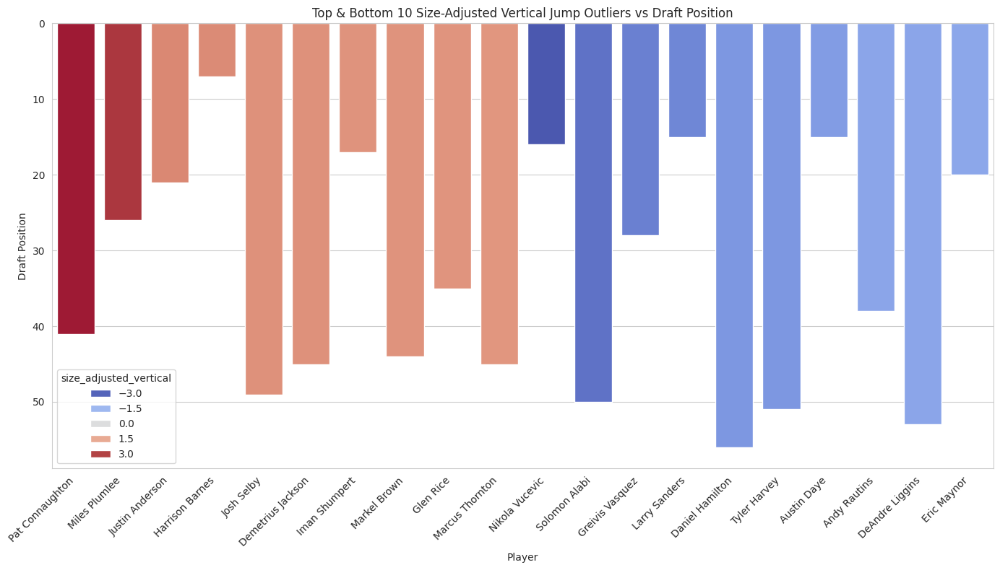
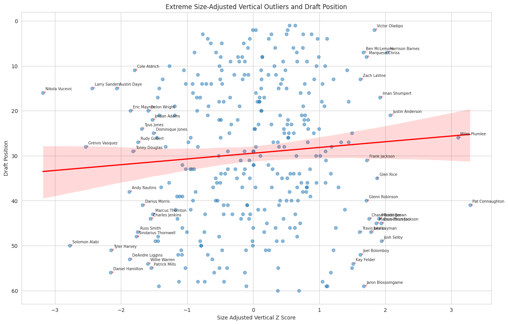

# NBA Draft Combine Analysis: Vertical Jump & Draft Value

## Overview

This project analyzes NBA Draft Combine data (2009–2017) to examine:

- Which physical attributes predict vertical jump performance  
- Whether vertical jump is associated with NBA draft position  
- Whether size-adjusted explosiveness provides a more meaningful signal of player evaluation  

The analysis combines statistical modeling, visualization, and hypothesis testing to better understand how physical traits and performance metrics relate to draft outcomes.

---

## Research Questions

1. Which physical attributes (height, weight, body fat %) best predict vertical jump performance?  
2. Is vertical jump associated with NBA draft position?  
3. Does performance relative to body composition (size-adjusted explosiveness) provide additional insight?

---

## Dataset

- Source: GitHub NBA Draft Combine dataset  
- Sample size: **N = 517 players**  
- Years: 2009–2017  

---

## Methods

- Exploratory data analysis with scatterplots and regression lines  
- Pearson correlation analysis  
- Spearman rank correlation analysis  
- Multiple linear regression modeling  
- Residual-based feature engineering (size-adjusted vertical jump)  
- Group-based comparisons and outlier analysis  

---

## Key Findings

- Height, weight, and body fat percentage are all negatively associated with vertical jump  
- The regression model explains approximately **28% of the variation** in vertical jump ($R^2 \approx 0.28$)  
- Raw vertical jump shows **little to no meaningful relationship** with draft position  
- Size-adjusted explosiveness provides a **more informative signal** than raw vertical jump  
- Relative performance (vs expected) may be more useful than absolute combine metrics in player evaluation  

---

## Regression Insights

These coefficients represent the expected change in vertical jump (in inches), holding other variables constant:

- **Height:** -0.42 → taller players tend to jump lower  
- **Weight:** +0.01 → minimal independent effect  
- **Body Fat:** -0.56 → strongest negative association  

**Intercept:** 69.23 (not practically meaningful in this context)

---

## Hypothesis Test

To test whether vertical jump is associated with draft position:

- **Null Hypothesis (H₀):** No relationship exists between vertical jump and draft position  
- **Alternative Hypothesis (Hₐ):** A relationship exists between vertical jump and draft position  

Using both **Pearson and Spearman correlation tests**, results indicate:

> There is little to no meaningful relationship between raw vertical jump and draft position.

---

## Key Takeaway

Body composition plays a more critical role in vertical jump performance than structural size alone. While raw vertical jump is not strongly associated with draft outcomes, **performance relative to physical profile (size-adjusted explosiveness)** provides a more meaningful perspective for evaluating players.

---

## Visualizations

### Vertical Jump vs Physical Attributes

  
  
  

### Vertical Jump vs Draft Position

  
  

### Additional Analysis

  
  
  
  

---

## Project File

- `nba_combine_analysis_final.ipynb` → Final structured analysis  

---

## Tools Used

- Python (pandas, numpy)  
- seaborn, matplotlib  
- scikit-learn  
- scipy  

---

## How to Run

1. Clone the repository  
2. Install dependencies:3.
3. Open:
4. Run all cells  

---

## Author

Tavares Martin
